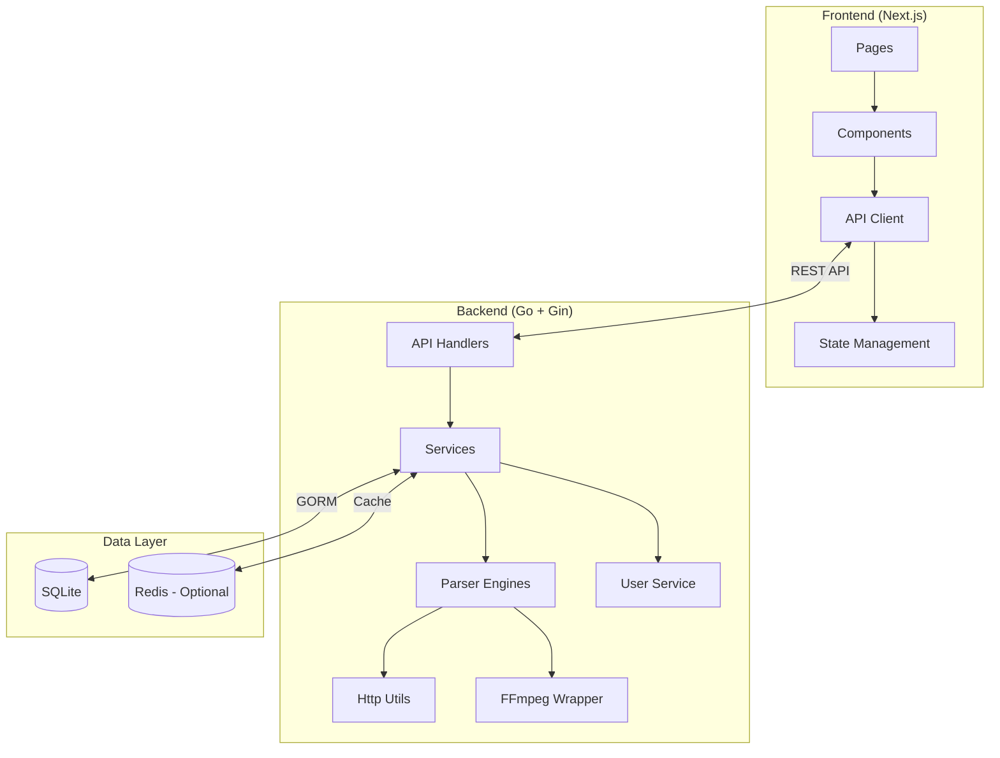
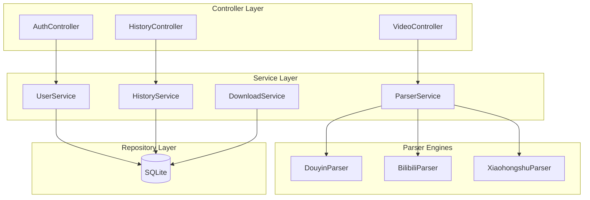
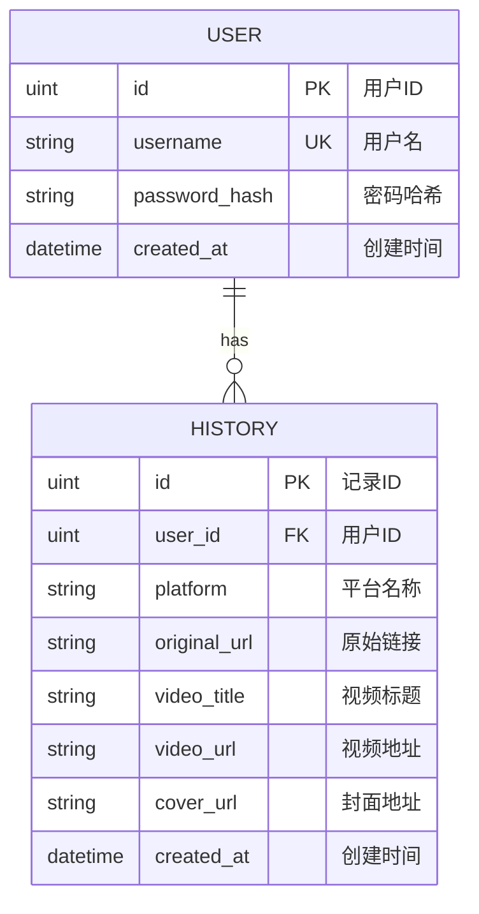

# 视频去水印下载网站 - 技术架构

## 1. Architecture Design



## 2. Technology Description
- 前端: Next.js@14 + React@18 + TypeScript + Tailwind CSS + shadcn/ui
- 初始化工具: create-next-app
- 后端: Go@1.21 + Gin@v1.9 + GORM
- 数据库: SQLite (文件数据库，无需额外服务)
- 视频处理: FFmpeg

## 3. Route Definitions

| Route | Purpose | Auth |
|-------|---------|------|
| / | 首页，视频解析入口 | No |
| /login | 用户登录页 | No |
| /register | 用户注册页 | No |
| /dashboard | 用户中心 | Yes |
| /history | 历史记录 | Yes |
| /batch | 批量下载 | No |

## 4. API Definitions

### Type Definitions
```typescript
// API 响应基础结构
interface ApiResponse<T> {
  success: boolean;
  data?: T;
  error?: string;
}

// 视频信息
interface VideoInfo {
  id: string;
  platform: string;
  title: string;
  coverUrl: string;
  videoUrl: string;
  duration?: number;
  author?: string;
}

// 解析请求
interface ParseRequest {
  url: string;
}

// 解析响应
type ParseResponse = ApiResponse<VideoInfo>;

// 用户信息
interface User {
  id: number;
  username: string;
  createdAt: string;
}

// 登录请求
interface LoginRequest {
  username: string;
  password: string;
}

// 登录响应
interface LoginResponse {
  token: string;
  user: User;
}

// 历史记录
interface HistoryItem {
  id: number;
  platform: string;
  originalUrl: string;
  videoTitle: string;
  videoUrl: string;
  coverUrl: string;
  createdAt: string;
}
```

### API Endpoints
```
POST   /api/parse          - 解析视频链接
GET    /api/video/:id      - 获取视频信息
POST   /api/download       - 下载视频
POST   /api/auth/register  - 用户注册
POST   /api/auth/login     - 用户登录
GET    /api/user/profile   - 获取用户信息 (需认证)
GET    /api/history        - 获取历史记录 (需认证)
POST   /api/history        - 添加历史记录 (需认证)
DELETE /api/history/:id    - 删除历史记录 (需认证)
GET    /api/health         - 健康检查
```

## 5. Server Architecture Diagram



## 6. Data Model

### 6.1 Data Model Definition


### 6.2 数据表结构
```sql
-- 用户表
CREATE TABLE users (
    id INTEGER PRIMARY KEY AUTOINCREMENT,
    username TEXT NOT NULL UNIQUE,
    password_hash TEXT NOT NULL,
    created_at DATETIME DEFAULT CURRENT_TIMESTAMP
);

-- 历史记录表
CREATE TABLE histories (
    id INTEGER PRIMARY KEY AUTOINCREMENT,
    user_id INTEGER NOT NULL,
    platform TEXT NOT NULL,
    original_url TEXT NOT NULL,
    video_title TEXT,
    video_url TEXT,
    cover_url TEXT,
    created_at DATETIME DEFAULT CURRENT_TIMESTAMP,
    FOREIGN KEY (user_id) REFERENCES users(id)
);

-- 创建索引
CREATE INDEX idx_histories_user_id ON histories(user_id);
CREATE INDEX idx_histories_created_at ON histories(created_at DESC);
```
