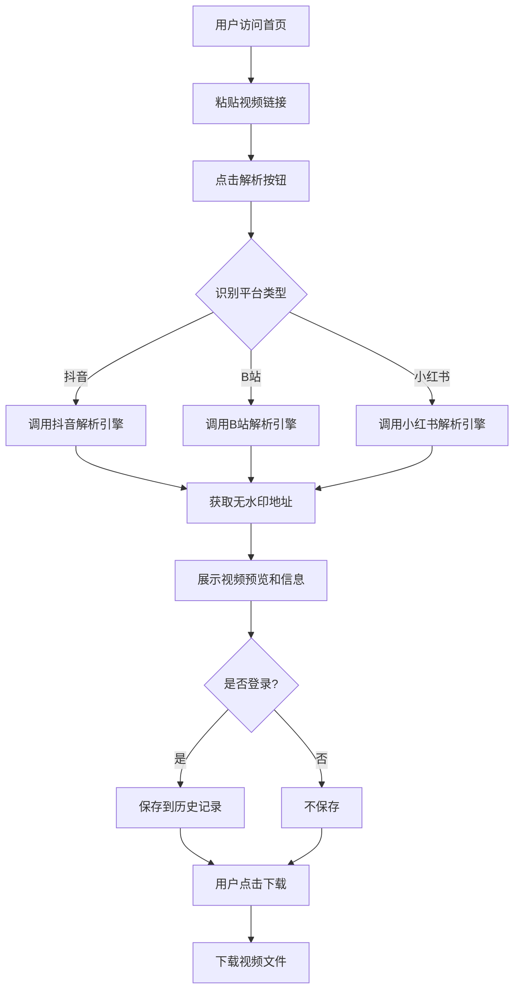

# 视频去水印下载网站 - PRD

## 1. Product Overview
前后端分离的视频去水印下载网站，支持主流短视频/长视频平台的无水印视频解析与下载，服务于个人学习用途。
- 解决用户获取无水印原始视频的需求，避免复杂的技术操作
- 提供简洁易用的界面，降低技术门槛，支持批量处理和历史记录管理

## 2. Core Features

### 2.1 User Roles
| Role | Registration Method | Core Permissions |
|------|---------------------|------------------|
| 普通用户 | 用户名/密码注册 | 解析视频、下载视频、查看历史记录 |

### 2.2 Feature Module
1. **首页**: 视频链接输入框、解析结果展示、视频预览
2. **用户认证页**: 登录、注册
3. **用户中心**: 个人信息、历史记录管理
4. **批量下载页**: 多链接批量解析与下载

### 2.3 Page Details
| Page Name | Module Name | Feature description |
|-----------|-------------|---------------------|
| 首页 | Hero 区域 | 简洁的标语和视频链接输入框，支持一键粘贴 |
| 首页 | 解析结果区域 | 视频预览、视频信息展示、下载按钮 |
| 首页 | 平台支持列表 | 展示支持的视频平台图标 |
| 登录页 | 登录表单 | 用户名/密码输入、登录按钮、注册跳转 |
| 注册页 | 注册表单 | 用户名/密码/确认密码输入、注册按钮 |
| 用户中心 | 历史记录列表 | 分页展示解析历史，支持删除操作 |
| 用户中心 | 个人信息卡 | 用户名、注册时间、使用统计 |
| 批量下载页 | 批量输入区域 | 多行文本框输入多个链接，批量解析按钮 |
| 批量下载页 | 批量结果区域 | 展示所有解析结果，支持一键全部下载 |

## 3. Core Process
用户访问网站 → 粘贴视频链接 → 点击解析按钮 → 系统分析链接平台 → 调用对应解析引擎 → 获取无水印视频地址 → 展示视频预览和信息 → 用户点击下载 → 下载视频文件（已登录用户自动保存历史记录）

## 4. User Interface Design
### 4.1 Design Style
- 主色: 蓝色 (#3b82f6)，次色: 深灰 (#1f2937)
- 按钮风格: 圆角矩形，简洁现代
- 字体: Inter / system-ui，标题 24-32px，正文 14-16px
- 布局风格: 卡片式布局，顶部导航栏
- 图标风格: 线性简洁图标，使用 Lucide Icons

### 4.2 Page Design Overview
| Page Name | Module Name | UI Elements |
|-----------|-------------|-------------|
| 首页 | Hero 区域 | 居中布局，大标题，渐变背景，突出的输入框 |
| 首页 | 解析结果 | 视频播放器卡片，信息展示区域，下载按钮组 |
| 用户认证 | 登录/注册 | 居中卡片表单，背景虚化，简洁输入框 |
| 用户中心 | 历史记录 | 表格/卡片列表，搜索框，分页组件 |
| 批量下载 | 批量区域 | 多行文本框，进度指示器，结果网格 |

### 4.3 Responsiveness
桌面端优先设计，移动端自适应，触摸区域优化，确保在手机、平板和桌面设备上都有良好体验。

### 4.4 Footer Design
底部固定区域显示法律声明和免责条款，明确提示仅供个人学习使用，禁止商业用途。
